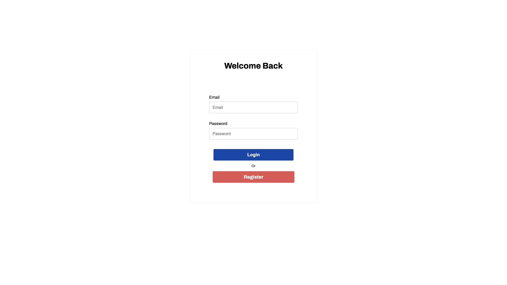
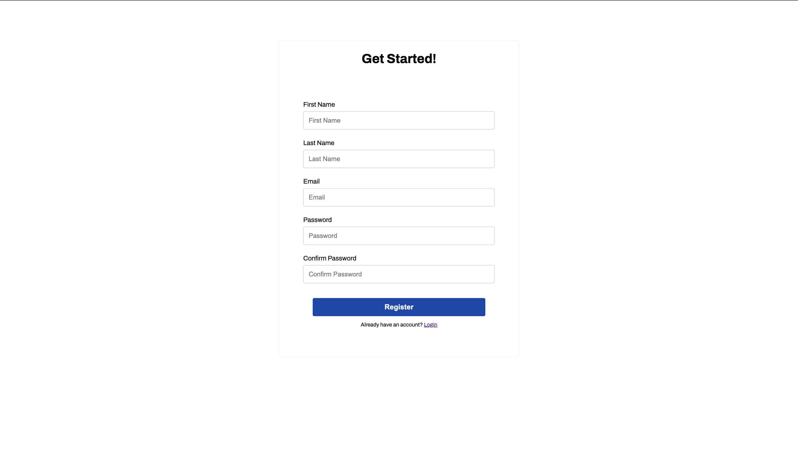
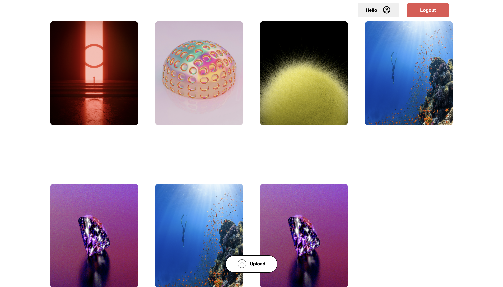

# Distributed Photo Cloud

Designed and developed a Distributed Cloud system for image storage.

The web application is composed of three services, each built using different technologies and frameworks:

### Frontend Service  
– Provides the UI for the application.  
– Developed using **React.js**.

### Authentication Service  
– Handles user authentication using **JWT**.  
– Developed using **Express** and **Node.js**.

### Image Storage Service  
– Verifies JWT tokens passed from the frontend and serves images based on the user ID extracted from the token.  
– Also handles image compression when supplying multiple images on the dashboard to reduce response time.  
– Developed using **Spring Boot**.

The backend also utilizes a **MySQL** database to store user information and images.  
Images are stored in raw format (Base64-encoded) to ensure compatibility with React’s `` component.  

The backend was initially tested on **Amazon RDS**, but has been moved to **Aiven Test Database Cloud Services** due to the hobby nature of this project.

---

## Screenshots

---

## Current Progress

Currently working on **Stripe Developer API Integration** to test a mock subscription model.  
Since the size of images being stored can be tracked, it will be used to cap usage per user based on their plan.

Additionally, working on:
- Improving UI responsiveness  
- Reducing backend response time for multi-image queries

